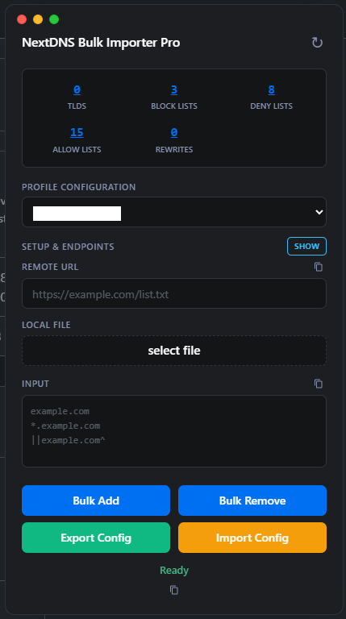
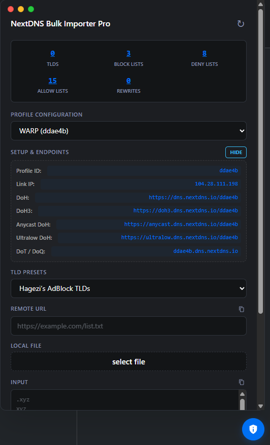
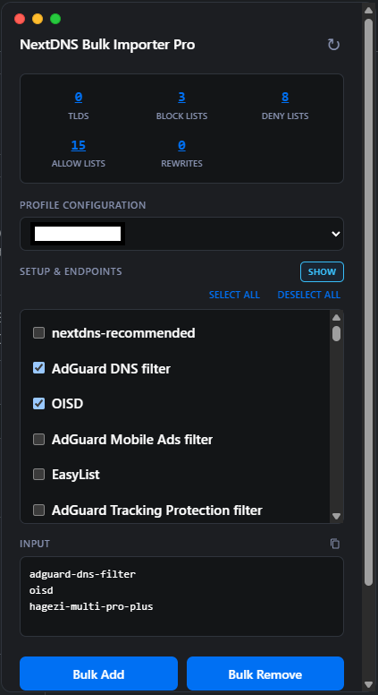

# NextDNS Bulk Importer Pro

NextDNS userscript bulk import automation designed for advanced NextDNS users. Easily manage TLDs, blocklists, denylists, allowlists, and rewrites with a responsive, clean interface. Import and Export Config.

> [!WARNING]
> I am not responsible for what happens to your profile or NextDNS account. 
> Use this script entirely at your own risk. Always back up your configurations or test on a secondary profile before importing large data.
> This script is designed to automate bulk actions for your convenience, but you are entirely responsible for what you import into your profile.

---

## 📸 Screenshots

| | | |
| :---: | :---: | :---: |
|  |  |  

---

## Features
* **Bulk Add & Remove:** Bulk Add/Remove: TLDs, Blocklists, Denylists, Allowlists and Rewrites.
* **Setup & Endpoints:** Shows Info for ID, DoH, DoT, DoH3, Anycast and Ultralow servers. *Fixing Link IP button*
* **One-Click Complete Backup:** Generates a compiled backup .json file of your current profile settings. Deploy the backup to your existing NextDNS Profile or a new NextDNS Profile. You can share the config with others.
* **Hagezi’s AdBlock TLDs:** Supports Hagezi’s AdBlock TLDs. Select from the presets. NextDNS doesn’t support adding domains to TLDs, switch to denylist for that. *adding more soon*
* **Skip Duplicates:** Automatically skips duplicate domains to save time.
* **Supports AdBlock format:** Import your personal list in AdBlock format. Supports using *||example.com^*, *@@||example.com^*, *||example.com^$dnsrewrite=0.0.0.0 (IP only)*
* **Rate-Limit Optimization:** Automatically pauses and resumes when it reaches NextDNS api limit.
* **Logs:** Shows what was imported, skipped and failed.

---

## Compatible Userscript Manager
First, add a userscript manager extension to your web browser if you don't have one already:
* **Tampermonkey** (Recommended for Chrome, Edge, Safari, Firefox)
* **Violentmonkey** (Great open-source alternative)
* **Userscripts/Stay** (iOS alternative)
* **Firefox/Kiwi Browser** (Android alternative)

## How to Use
1. Go to your [NextDNS Dashboard](https://my.nextdns.io/).
2. Click the new blue shield icon in the bottom-right corner to open the panel.
3. Choose what you want to import (Deny Lists, Allow Lists, TLDs, Rewrites, etc.).
4. Paste your list, upload a text file, or enter a URL, then click **Bulk Add** or **Bulk Remove**.

---

## Coming Soon

* Faster API processing
* Advanced Profile Editor
* More TLDs presets
* Denylist & Allowlist presets
